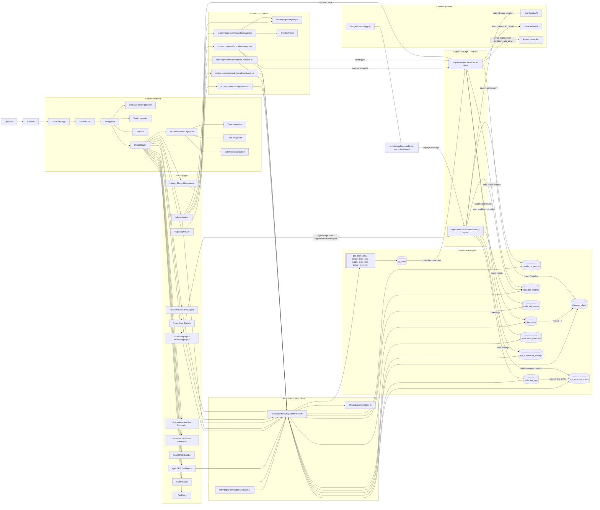
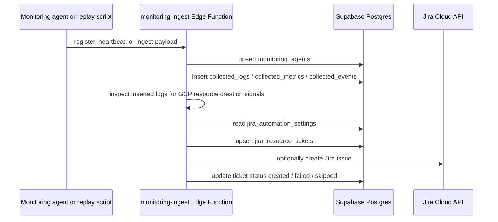
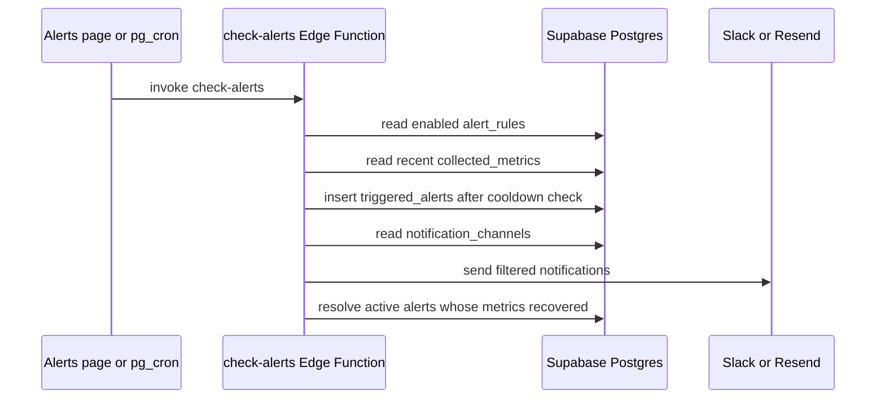
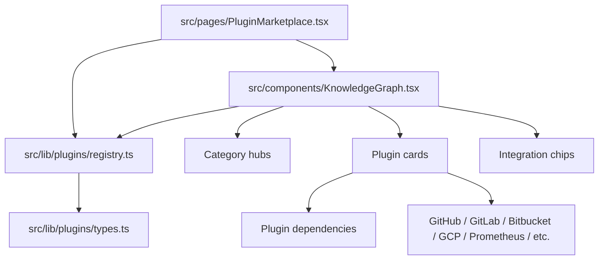
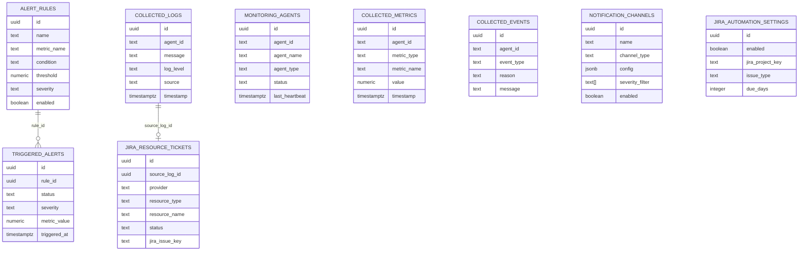

# Repository Knowledge Graph

This map describes the current repository as an operational knowledge graph: app surfaces, shared components, backend functions, database tables, external systems, and the flows between them.

## System Graph

## Primary Flows

### Monitoring Ingestion

### Alert Evaluation

### Plugin Marketplace Graph

## Page-To-Data Matrix

| Page or component | Main role | Data sources / targets |
| --- | --- | --- |
| `src/pages/Dashboard.tsx` | Overview of operational health | `monitoring_agents`, `triggered_alerts`, `collected_logs`, `collected_events`, `alert_rules`, `jira_resource_tickets`, realtime channel `dashboard-overview` |
| `src/pages/GKEDashboard.tsx` | Cluster/log/event/metric visibility | `collected_logs`, `collected_events`, `collected_metrics`, `monitoring_agents`, realtime channel `gke-dashboard-realtime` |
| `src/pages/MonitoringAgent.tsx` | Agent instructions and registered agent status | `monitoring_agents`, realtime channel `monitoring-agents-changes` |
| `src/pages/Alerts.tsx` | Alert rule CRUD, active alerts, manual checks | `alert_rules`, `triggered_alerts`, Edge Function `check-alerts`, realtime channel `alerts-realtime` |
| `src/components/NotificationChannels.tsx` | Notification channel CRUD and test dispatch | `notification_channels`, Edge Function `check-alerts`, realtime channel `notification-channels-realtime` |
| `src/components/AlertHistoryDashboard.tsx` | Alert trend/history charts | `triggered_alerts` |
| `src/components/CronJobManager.tsx` | Schedule Edge Function checks | RPCs `get_cron_jobs`, `create_cron_job`, `toggle_cron_job`, `delete_cron_job` |
| `src/components/LogViewer.tsx` | Search/filter streamed logs | `collected_logs`, realtime channel `log-viewer-realtime` |
| `src/pages/JiraAutomation.tsx` | Jira automation settings and ticket history | `jira_automation_settings`, `jira_resource_tickets`, realtime channel `jira-automation-page` |
| `src/pages/CostDashboard.tsx` | Cost signal heuristics from telemetry | `collected_logs`, `collected_metrics`, `triggered_alerts`, `monitoring_agents`, realtime channel `cost-dashboard-signals` |
| `src/pages/SecurityAnalyzer.tsx` | Security signal heuristics from logs, alerts, tickets | `collected_logs`, `triggered_alerts`, `jira_resource_tickets` |
| `src/pages/TerraformGenerator.tsx` | Client-side Terraform template generator | Local React state only |
| `src/pages/CICDBuilder.tsx` | Client-side pipeline config generator | Local React state only |
| `src/pages/PluginMarketplace.tsx` | Plugin catalog and plugin graph | `pluginRegistry`, `KnowledgeGraph` |

## Database Relationship Graph

## Key Architecture Notes

- The frontend is mostly direct-to-Supabase: route pages use `src/integrations/supabase/client.ts` plus TanStack Query for fetching and cache invalidation.
- Realtime updates are table-publication based; migrations add the operational tables to `supabase_realtime`.
- `monitoring-ingest` is the write-heavy backend boundary. It registers agents, accepts logs/metrics/events, and optionally creates Jira tickets from GCP audit-style logs.
- `check-alerts` is the alerting backend boundary. It compares recent metrics against `alert_rules`, writes `triggered_alerts`, sends notifications, and resolves recovered alerts.
- The in-app `KnowledgeGraph` component currently visualizes the plugin registry, not this repository map. This document is the repo-level knowledge graph.
